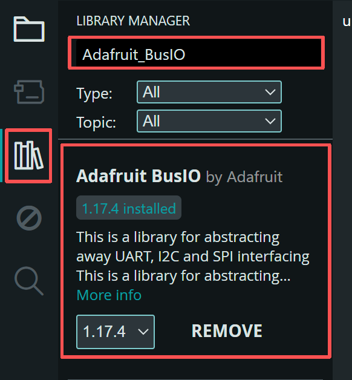
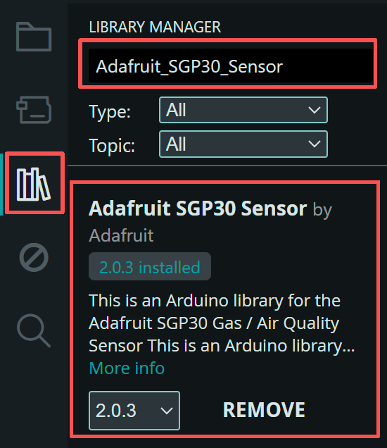
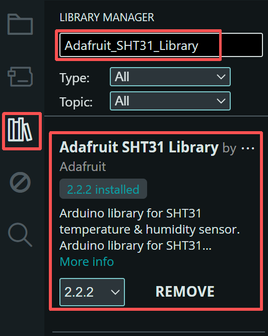
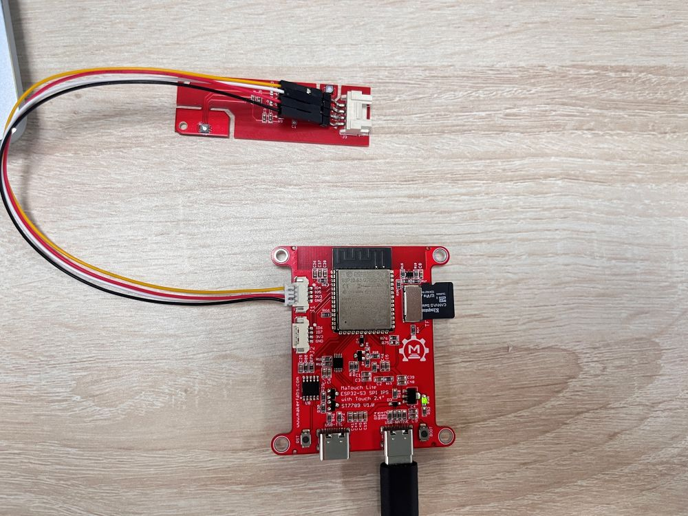
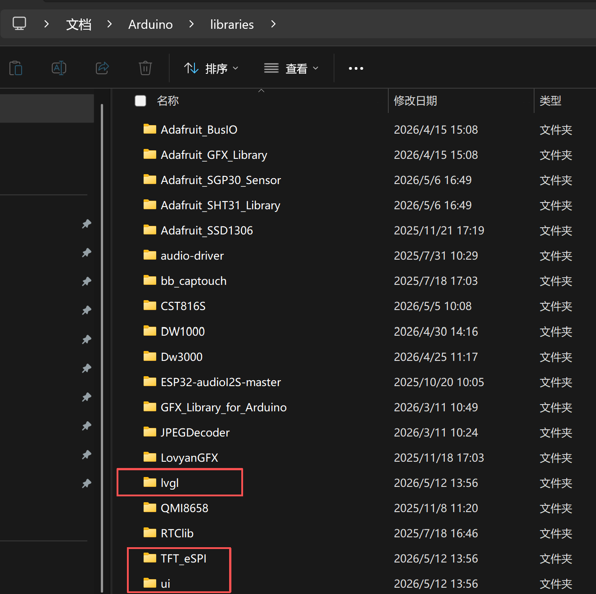
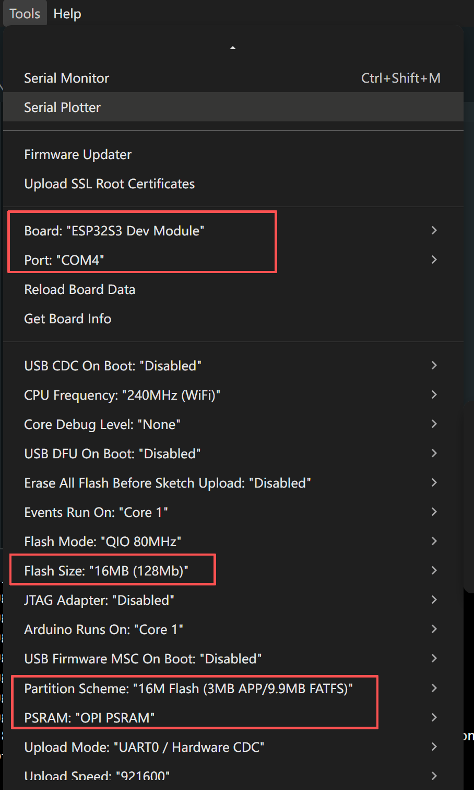
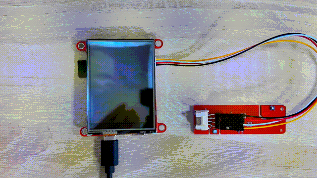

# Matouch_Lite_ESP32-S3-SPI-IPS-with-Touch-2.4-ST7789

## Introduce

Product Link: [Matouch_Lite_ESP32-S3-SPI-IPS-with-Touch-2.4-ST7789](https://www.makerfabs.com/matouch-lite-esp32-s3-spi-resistive-touch-2-4-st7789.html)

Wiki Link:  [Matouch_Lite_ESP32-S3-SPI-IPS-with-Touch-2.4-ST7789](https://wiki.makerfabs.com/MaTouch%20Lite%20ESP32_S3%20SPI%20IPS%20with%20Touch%202.4%20ST7789.html)

Example：[LVGL_Touch](https://github.com/Makerfabs/MaTouch_Lite_ESP32-S3-SPI-IPS-with-Touch-2.4-ST7789/blob/main/README.md#lvgl_touch)

## Feature

- Controller: ESP32-S3
- Wireless: WiFi& Bluetooth 5.0
- LCD: 2.4”, 320*240 resolution
- LCD Driver: ST7789V
- LCD Interface: SPI
- Flash: 16MB Flash
- PSRAM: 8MB
- Touch Panel: Resistive
- Touch Driver:NS2009
- USB: 1 * USB_native, 1 *USB-to-UART
- USB-UART Driver: CH340K
- Power Supply: USB Type-C 5.0V(4.0V~5.25V)
- Button: Flash button and reset button
- Expansion interface: 2*JST1.25mm-4P
- Camera: No
- LCD Backlight control: Yes
- Arduino support: Yes
- LVGL support: Yes

## Usage in Arduino IDE

- Install the Arduino IDE V1.8.19/V2.3.6
If you haven’t installed the ESP32 Board SDK yet, follow the steps in this [guide](https://wiki.makerfabs.com/Installing_ESP32_Add_on_in_Arduino_IDE.html) to get started quickly.

For the ESP32-S3 Development board version, we recommend using versions that have been verified, such as 2.0.16， which is more stable, and less prone to errors.

Note: Different computers may have different port numbers when connecting to a development board. Please select the correct port number based on the development board you are connecting to.

Please download the relevant driver libraries before using these demos.

1.Install Adafruit_BusIO v1.17.4

2.Install Adafruit_SGP30_Sensor v2.0.3

3.Install Adafruit_SHT31_Library v2.2.2

## Example

### LVGL_Touch

This demonstration showcases the integrated application of display and touch. The screen initially shows an image with data such as temperature, humidity, CO2, and TVOC. If the screen is not touched within 10 seconds, it will automatically turn off. After the screen turns off, clicking on it will make it bright again and display the data.

- First, connect the Mabee module to the ESP32-S3 module correctly, as shown in the figure.

- Download the library from [github](https://github.com/Makerfabs/Matouch_Lite_ESP32-S3-SPI-IPS-with-Touch-2.4-ST7789/tree/main/example/LVGL_Touch/libraries)

Once the download is complete, copy these libraries into the Arduino library.

- The default is usually in the "C:\Users\Your username\Documents\Arduino\libraries"

**Note: If the UI, LVGL or TFT_eSPI library already exists in your Arduino libraries folder, please delete them first, then install the new version of the UI, LVGL or TFT_eSPI library.**

- Open the [LVGL_Touch](https://github.com/Makerfabs/Matouch_Lite_ESP32-S3-SPI-IPS-with-Touch-2.4-ST7789/blob/main/example/LVGL_Touch/ui/ui.ino) by Arduino.

Connect the board to the computer using a Type-C USB data cable and via USB-TTL, and select the development board "ESP32S3 Dev Module" and the port.

- Select "Tools > board:"xxx" > ESP32 > ESP32S3 Dev Module".
- Select "Tools > Port",Select the port number of the board.
- Select Flash Size is 16MB(128MB), Partition Scheme is 16M Flash (3MB APP/9.9MB FATFS), PSRAM is OPI PSRAM.

- Click the Upload button in the Arduino IDE and wait a few times while the code compiles and uploads to your board.

